XSS in OWASP Juice Shop

Course: Cybersecurity Lab – XSS
Academic Year: 2025/2026
Student: Marwan Salman
Target application: OWASP Juice Shop (Docker image bkimminich/juice-shop)

1. Lab Goal

The goal of this lab is to identify and exploit two XSS vulnerabilities in OWASP Juice Shop and explain why they are classified as DOM XSS and Reflected XSS, even if the visible result (an alert box) looks similar.

The two required challenges are:
- Perform a DOM XSS attack (with <iframe src="javascript:alert(`Dom xss`)>).
- Perform a reflected XSS attack (also with <iframe src="javascript:alert(`Reflected xss`)>).

2. Environment Setup

1) Open Docker Descktop App on my laptop

2) Open My terminal and I started Juice Shop in unsafe mode to enable all XSS challenges:

   docker run --rm -p 3000:3000 -e NODE_ENV=unsafe bkimminich/juice-shop

3) I accessed the application at:

   http://localhost:3000

4) I created an account and logged in with:
   - Email: msalman@yahoo.com
   - Password: 12345

This matches the lab requirement to run Juice Shop locally with dangerous challenges enabled (NODE_ENV=unsafe).

3. DOM-based XSS in the Search Function

3.1. Normal behaviour of the search

1) After logging in, I clicked on the search icon (magnifying glass) in the top bar.
2) I typed the word "apple" into the search field and pressed Enter.
3) The page showed the products related to apples, and the title became:

   "Search Results - apple"

4) I opened Developer Tools → Network and observed the outgoing requests. The search term itself was not sent to the server in a vulnerable way; the search is handled on the client side.

Screenshot: DOM XSS – normal search ("apple").
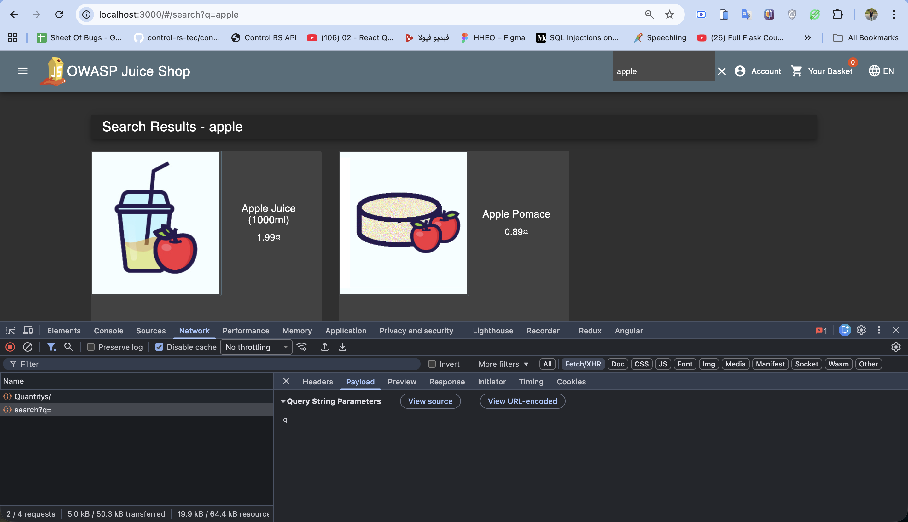

3.2. Injecting the script

5) I replaced the word "apple" with a JavaScript code:

   <iframe src="javascript:alert(`Dom xss`)">

6) After pressing Enter, an alert box popped up with the text "Dom xss". This means the application took my input and inserted it into the DOM as HTML without sanitization.

Screenshots: payload in search field and alert.
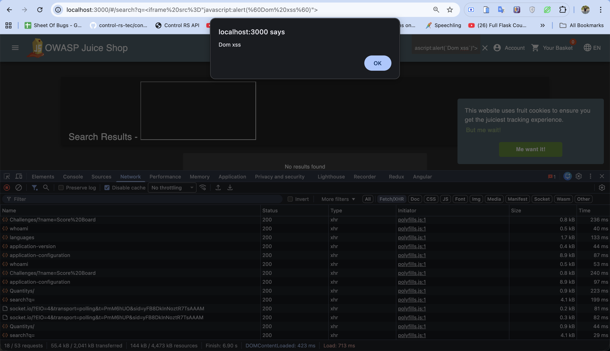
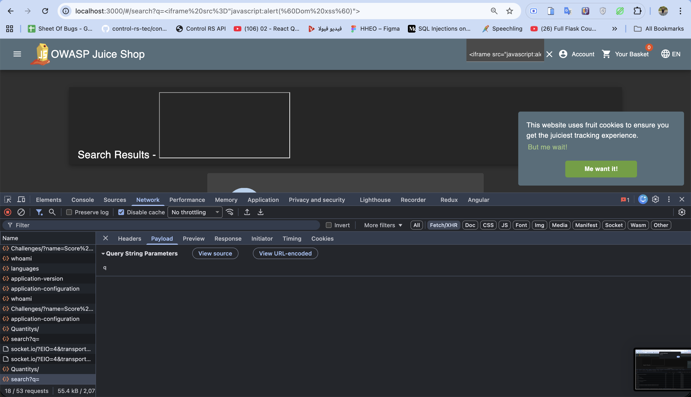

3.3. Why this is DOM XSS

- The value is read directly from the browser (from the search field or URL fragment) and then written back into the page by client-side JavaScript.
- The vulnerable flow happens completely in the browser: the server does not need to echo the value back for the exploit to work.

Because the payload never needs to be reflected by the server and is handled entirely within the DOM on the client, this vulnerability is correctly classified as DOM-based XSS.

4. Reflected XSS in the Order Tracking Function

4.1. Creating an order

1) From the search results, I added "Apple Juice (1000ml)" to my basket.
2) I opened the basket (/#/basket) and confirmed that the product was present.
3) I clicked Checkout, then filled in:
   - Delivery address
   - Delivery method
   - Payment method
4) I placed the order and reached the order completion page, which includes a "Track Order" link.

Screenshots: basket and delivery method.
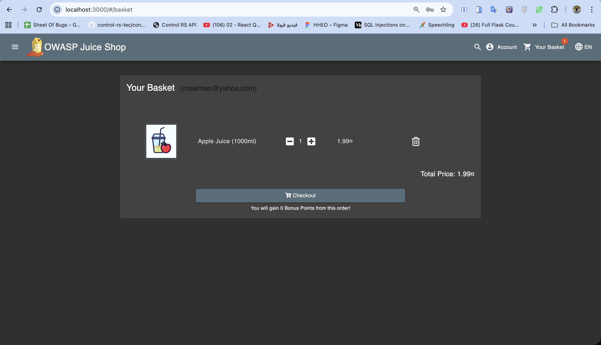
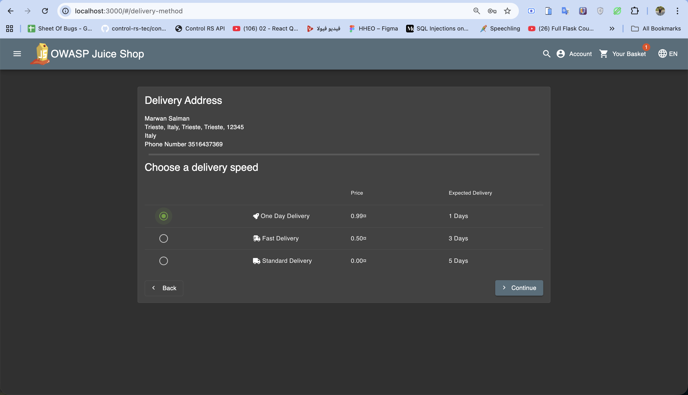
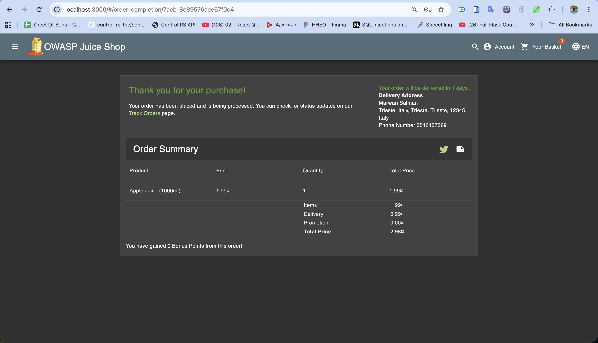

4.2. Observing the tracking URL and API

5) From the completion page I clicked "Track Order", which opened a URL like:

   http://localhost:3000/#/track-result/new?id=7aeb-8e89576aee67f0c4

6) The page showed a title similar to:

   "Search Results - 7aeb-8e89576aee67f0c4"
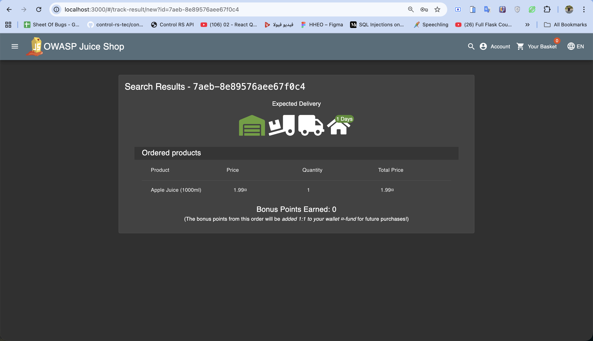

7) In Developer Tools → Network, I looked for the API that returns the order details. I found a request whose response contained JSON like:

   {
     "status": "success",
     "data": [
       {
         "orderId": "7aeb-8e89576aee67f0c4",
         ...
       }
     ]
   }

The orderId field in the response matched the id parameter in the URL and was displayed near "Search Results -" in the UI.

Screenshot: order details API with orderId.
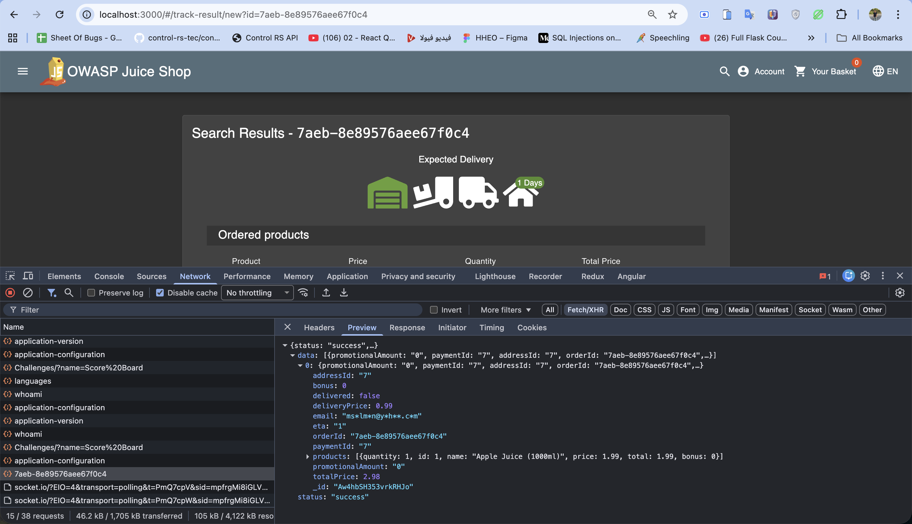
4.3. Changing the id parameter

8) I manually edited the URL and replaced the real order ID with a simple string:

   http://localhost:3000/#/track-result/new?id=1234

9) The page correctly updated the title to:

   "Search Results - 1234"

10) The API response changed accordingly and the JSON contained:

   {
     "status": "success",
     "data": [
       {
         "orderId": "1234"
       }
     ]
   }

This confirmed that whatever I place into id is forwarded to the backend endpoint and then sent back inside the orderId field.

Screenshot: modified id and returned orderId = "1234".
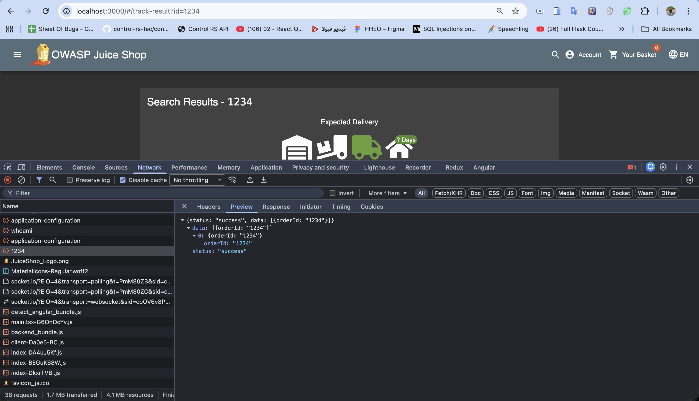
4.4. Injecting the XSS payload

11) I then replaced 1234 with a malicious payload:

   http://localhost:3000/#/track-result/new?id=<iframe src="javascript:alert(`reflected xss`)">

12) The backend responded with JSON containing the exact string I sent, now inside orderId:

   {
     "status": "success",
     "data": [
       {
         "orderId": "<iframe src=\"javascript:alert(`reflected xss`)\">"
       }
     ]
   }

13) The client-side code inserted this orderId value as HTML into the DOM, which immediately executed the payload and displayed a JavaScript alert with the text "reflected xss".

Screenshots: payload in URL, JSON response, and alert.
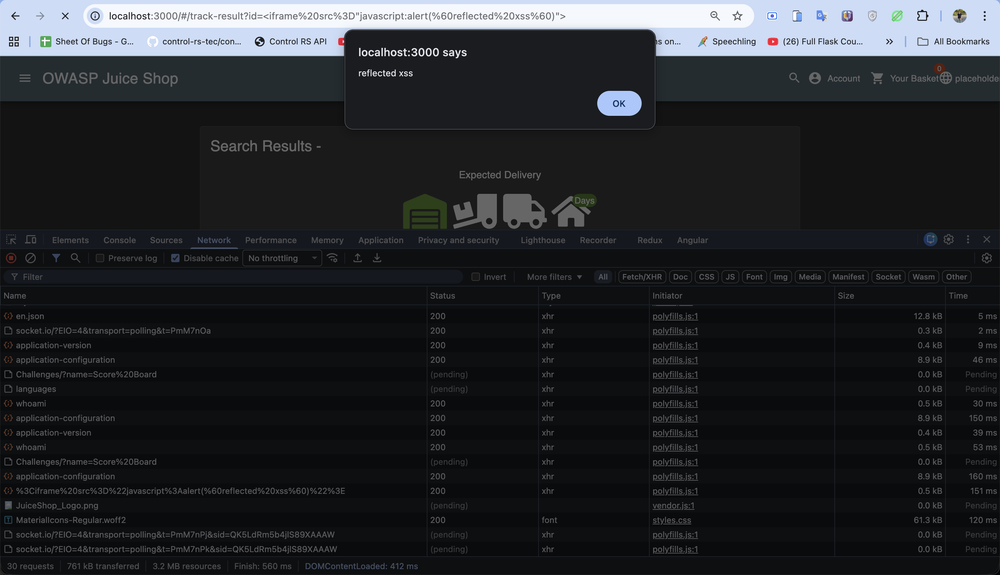
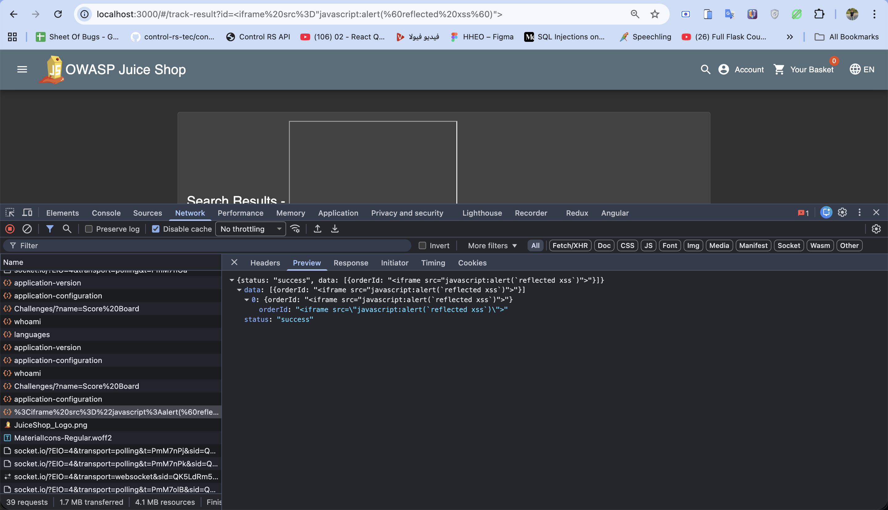
4.5. Why this is Reflected XSS

- The payload is first sent from the browser to the server as part of the URL (id parameter).
- The server endpoint uses this id to build a JSON response and reflects the same value in the orderId field without sanitization.
- The client then reads orderId and injects it into the page as HTML, allowing the JavaScript to execute.

Even though the DOM is involved in the final step, the key point is that the data makes a round trip to the server and back, so this issue is categorized as reflected XSS in the lab instructions.

1. Comparison: DOM XSS vs Reflected XSS in Juice Shop

Aspect: Input location
- DOM XSS – Search: Search bar in the header
- Reflected XSS – Track Order: id parameter in "#/track-result/new?id=..."

Aspect: How input is used
- DOM XSS – Search: JavaScript reads the value directly from the DOM and writes it into another DOM element.
- Reflected XSS – Track Order: JavaScript sends value to backend; server includes it in JSON as orderId.

Aspect: Server involvement in the vulnerable flow
- DOM XSS – Search: None (payload does not have to be sent to the server).
- Reflected XSS – Track Order: Yes, payload is reflected by the track-order API.

Aspect: Where HTML injection occurs
- DOM XSS – Search: Purely client-side DOM update.
- Reflected XSS – Track Order: Client inserts server-supplied orderId into DOM.

Category
- DOM XSS – Search: DOM-based XSS.
- Reflected XSS – Track Order: Reflected XSS.

From the user’s perspective, both vulnerabilities look the same (an alert pops up when a special string is used), but the underlying data flows are different, which justifies the different labels.

6. Security Impact and Mitigations

Impact:
- An attacker can craft URLs that execute arbitrary JavaScript in the victim’s browser when opened, leading to session theft, account takeover, or malicious redirects.

Root causes:
- Insecure use of DOM sinks with untrusted data (for example, innerHTML or unsafe Angular bindings).
- Lack of server-side validation and output encoding for the id / orderId fields.

Recommended mitigations:
- Never insert raw user-controlled HTML into the DOM; use safe text bindings or sanitize input before rendering.
- Avoid using Angular APIs that bypass sanitization (such as trustAsHtml) on data that can come from users.
- Validate and encode all values that are returned by the backend and later rendered on the client.

7. Conclusion

In this lab I exploited two XSS vulnerabilities in OWASP Juice Shop: one purely DOM-based in the search feature and one reflected through the order tracking API. By analyzing how the application processes the input in each case, it becomes clear why the first vulnerability is classified as DOM XSS and the second as reflected XSS, even though the final effect in the browser is similar.
