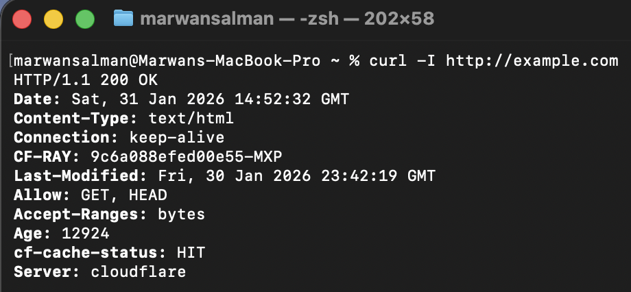
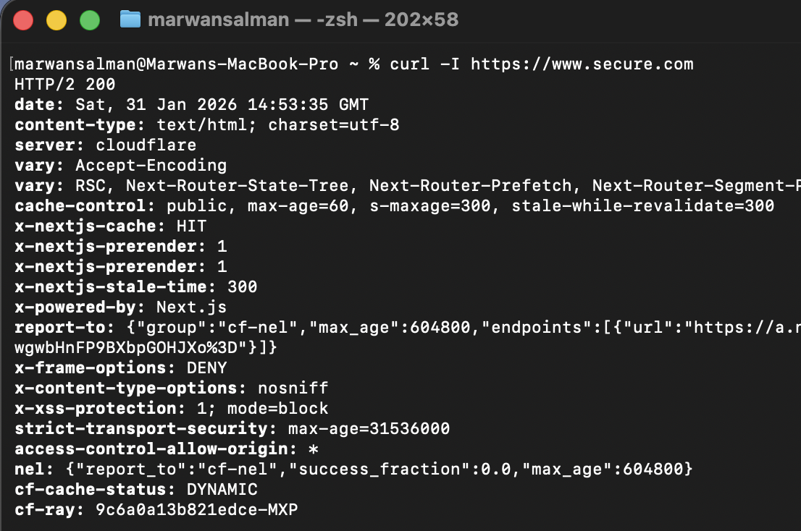
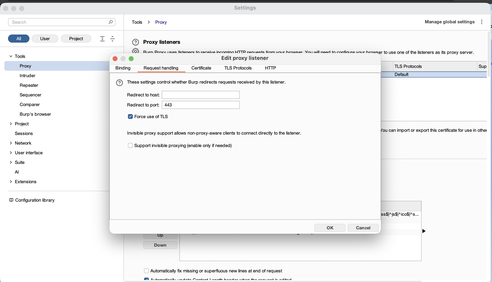
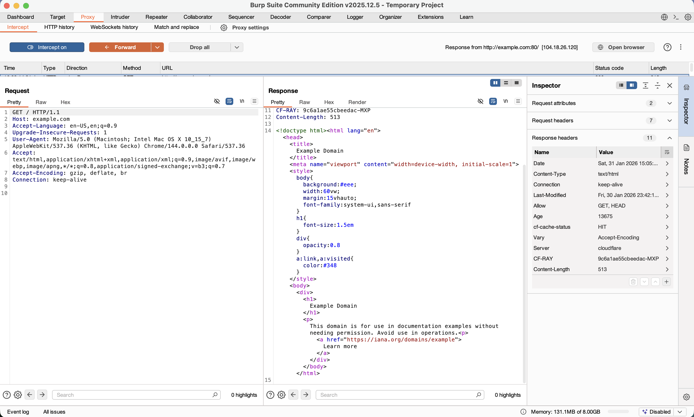
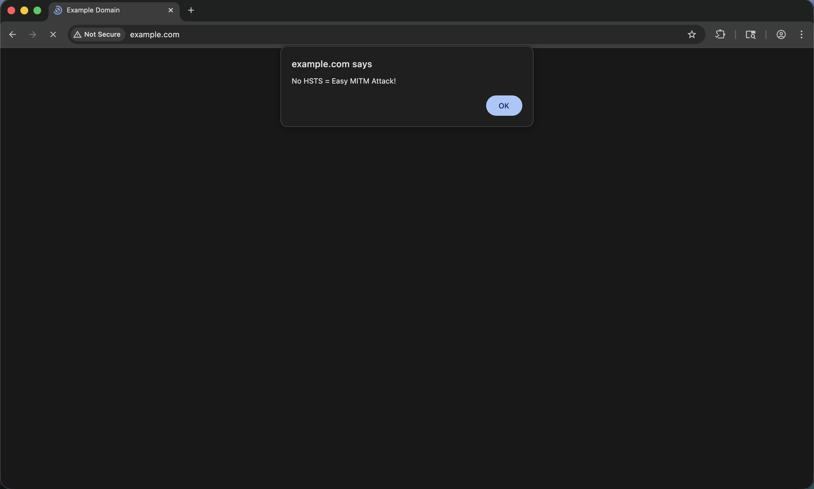
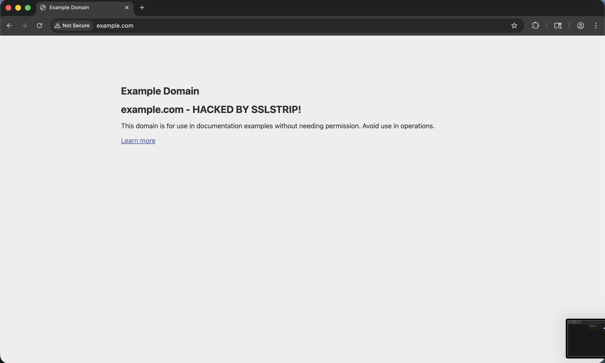
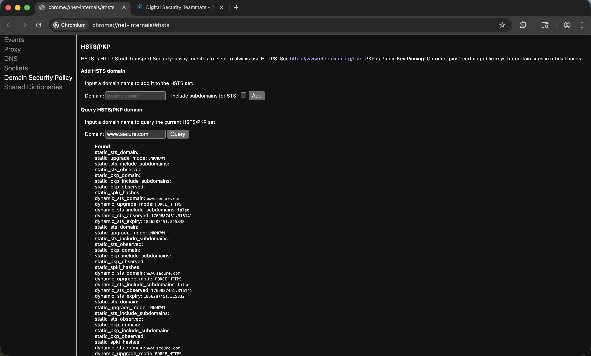
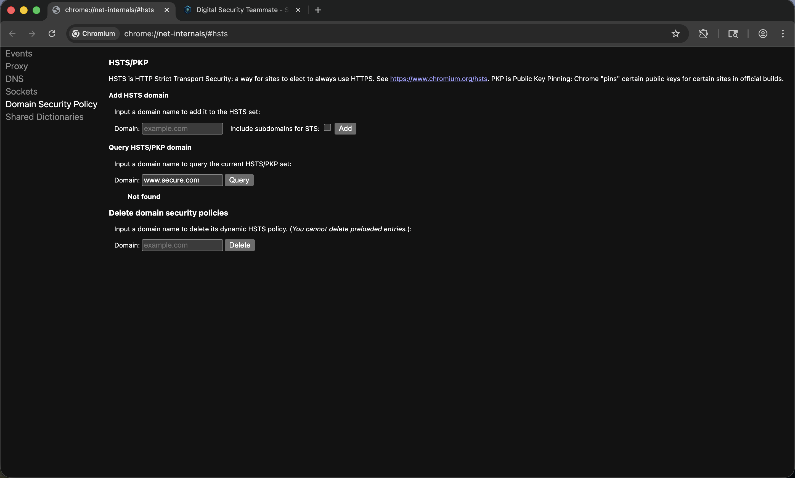
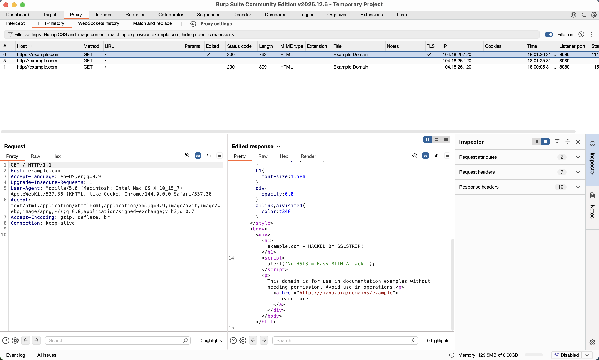

# 🛡️ AITM Lab 1: HSTS vs SSLStrip Attack Analysis

**Author:** Marwan  
**Course:** Cybersecurity Lab - AITM (Advanced IT Security Management)  
**Academic Year:** 2025/2026  
**Submission:** `06_AITM_1`  
**Date:** January 31, 2026

---

## 📋 Lab Objectives

Demonstrate **HTTP Strict Transport Security (HSTS)** protection against **SSLStrip** MITM attacks:

| Case | Target | HSTS | Result |
|------|--------|------|--------|
| **A** | `example.com` | ❌ None | **Attack Succeeds** |
| **B** | `secure.com` | ✅ Enabled | **Attack Blocked** |

---

## 🔍 Pre-Attack Verification (Terminal)

**HSTS Header Analysis:**

**Results:**
example.com → ❌ No Strict-Transport-Security
secure.com → ✅ Strict-Transport-Security: max-age=31536000

---

## ⚙️ Burp Suite SSLStrip Configuration

**Critical Settings:**
- ✅ Use TLS for upstream connections
- ❌ No forced HTTPS redirection
- Proxy: `127.0.0.1:8080`

---

## 🚨 Case A: SSLStrip Attack SUCCESS (example.com)

### 1. Intercepted Original Response

### 2. HTML Modification (MITM Attack)

**Changed:** `"Example Domain"` → `"example.com HACKED BY SSLSTRIP"`

### 3. Attack Result in Browser

**Browser shows:**
- `http://` address bar (unencrypted)
- **No security warnings**

---

## 🔒 Case B: HSTS Protection (secure.com)

### 1. Browser HSTS Cache

chrome://net-internals/#hsts → www.secure.com ✓ ENABLED

### 2. HTTP Access Attempt BLOCKED

**Browser auto-upgrades** `http://wwww.secure.com` → `https://www.secure.com`

### 1. Browser HSTS Cache
chrome://net-internals/#hsts → www.secure.com ✓ DISABLED

### 2. HTTP Access Attempt PASSED

**Browser auto-upgrades** `http://wwww.secure.com` → `http://www.secure.com`

---

## 📊 HTTP History Comparison (Burp)

---
### Security Impact

**Without HSTS:** Complete MITM - malware injection possible  
**With HSTS:** Browser-level protection defeats SSLStrip automatically

---